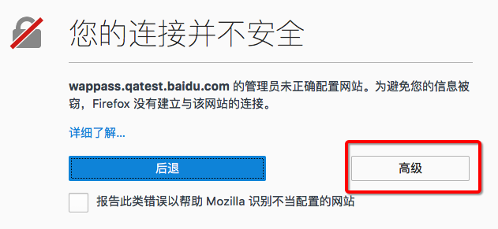
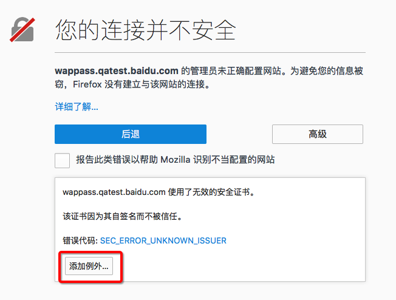
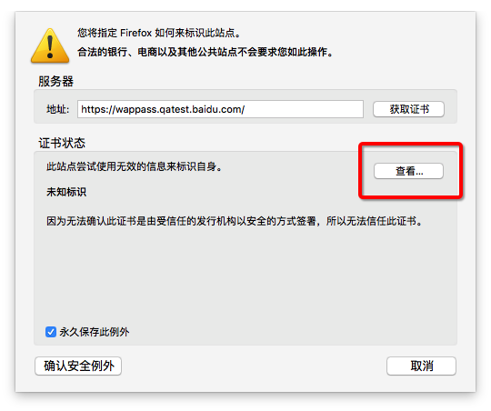
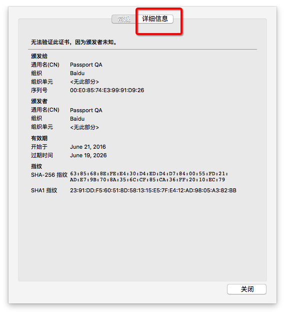
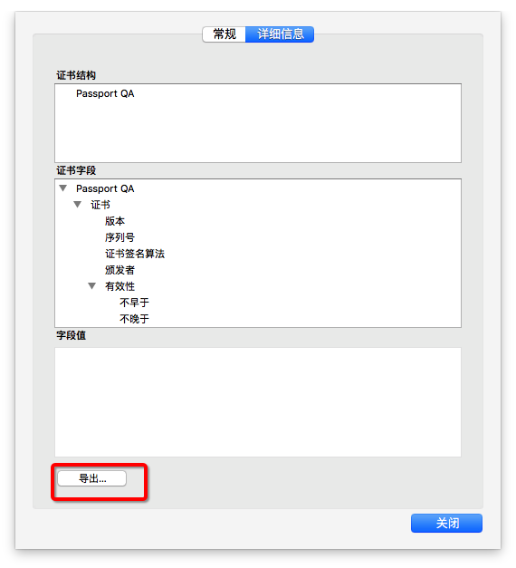
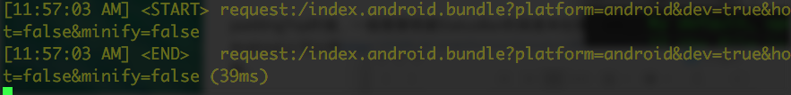
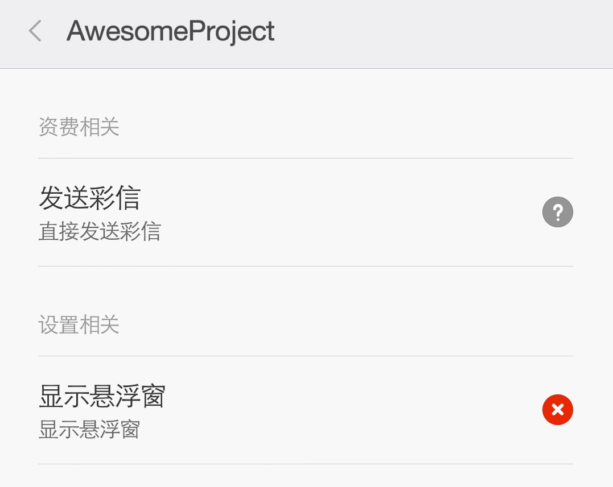

### ios下webview加载http地址报错怎么办？

由于ios9的ATS 策略，ios9只能使用https地址，如果只能使用http，可以屏蔽掉

```
	<key>NSAppTransportSecurity</key>
	<dict>
		<key>NSExceptionDomains</key>
		<dict>
			<key>localhost</key>
			<dict>
			<key>NSTemporaryExceptionAllowsInsecureHTTPLoads</key>
			<true/>
			</dict>
		</dict>
	</dict>
```

### ios下webview加载https也会报错怎么办？

ATS对https有限制，可以尝试禁用某些限制

```
<dict>
	<key>NSExceptionDomains</key>
	<dict>
		<key>xxx.com</key>
			<dict>
                <key>NSIncludesSubdomains</key>
                <true/>
			   <key>NSTemporaryExceptionAllowsInsecureHTTPLoads</key>
			   <true/>
                <key>NSExceptionRequiresForwardSecrecy</key>
                <false/>
		</dict>
	</dict>
</dict>
```

可以尝试`NSTemporaryExceptionAllowsInsecureHTTPLoads`,`NSExceptionRequiresForwardSecrecy`等配置。

### Android下webview加载https竟然也会出现空白页的情况，怎么办？

出现这种情况一般是因为https使用的是系统不能信任的自签名的证书，线上环境建议还是使用系统可以信任的证书。修改Android的代码，是可以解决这个问题的，网上有很多native的忽略https自签名证书的办法，具体不介绍了（其实我也没研究，因为不想写native的代码）

如果是测试环境，只想在某一台测试机上使用，这是有解决办法的——让手机信任该自签名的证书，具体步骤如下。

1. 下载该证书

   具体下载该证书的办法：

   1. 打开firefox浏览器（只有firefox找到了下载证书的方法），访问自签名的https网址，如`wappass.qatest.baidu.com`
   2. 
   3. 
   4. 
   5. 
   6. 
   7. 然后找个地方保存证书就好了。

2. 将证书导入到手机中（以MIUI为例）

   1. 首先要将证书放到手机中
   2. 进入 设置->其他高级设置->安全和隐私->凭据存储->从SD卡安装
   3. 选择需要安装的证书，凭据用途选择“VPN和应用”，这样就可以了
   4. 如果提示输入密码，就输入手机的锁屏密码即可（没有就设置一个）

3. 这时候再用该手机访问该地址的时候就能得到正确的https网址的返回了。

### 引用jsx文件组件报错，提示can't resolve module怎么回事？

首先要确认文件路径写对了，然后把.jsx文件改成.js文件即可。rn好像不知道.jsx文件，我没追查。

### RN所支持的最低iOS和Android版本？

Android >= 4.1 (API 16)

iOS >= 7.0


### 有时候ios模拟器点不动，运行的特别慢怎么办？

可能是因为xcode 的iOS模拟器 Slow Animations打开了，导致了响应特别慢。在模拟器的Debug菜单中，关掉Slow Animations就好了。关掉Slow Animations之后，模拟器响应的都快了，非常好用，建议模拟器这一项不要开着。

### StatusBar盖在了View上面，导致内容重叠了，特别丑，怎么处理？

StatusBar盖在View上面是有理由的，这样StatusBar设置成透明的就可以和下面的界面融在一起，所以需要用paddingTop做处理，不让文字等重叠，但是要让背景和StatusBar重叠。

paddingTop的值，一般需要根据StatusBar的高度来处理，iOS上StatusBar一般为20，Android上可以用https://github.com/jaysoo/react-native-extra-dimensions-android来获取。

### Android：使用真机调试的时候可以不连数据线吗？能直接通过WIFI或者蓝牙进行调试吗？

可以的，方法如下：

1. 首先开启手机的开发者模式，打开usb调试（自行百度）
2. 通过数据线连接手机和电脑
3. 在电脑terminal上输入`adb tcpip 4455`
4. 打开手机，进入连接的WIFI详情，查看手机的IP地址为`192.168.44.1`
5. 在电脑terminal上输入`adb connect 192.168.44.1:4455`
6. 这时候在电脑上输入`adb devices`，就可以看到连接了的设备了，这时候就可以不用数据线直接进行调试了。

注：步骤1和2只需要设置一次即可。

### Android：在真机上安装APP后，打开是白屏是怎么回事？

如果真机打开是白屏，虚拟机打开可以正常显示，很有可能是因为并没有加载react native的js代码。如果下载了js代码的话，dev server的终端会出现一个下载日志的。



根据[官方文档](http://facebook.github.io/react-native/docs/running-on-device-android.html#content)，对于Android5.0以上的设备需要运行`adb reverse tcp:8081 tcp:8081`，对于5.0一下的设备需要开启react native的开发窗口进行设置。

根据官方文档，需要按 menu 键或者摇晃手机，在开发菜单中设置一下 dev server 的 IP 地址，但是在某些手机上没有menu键，或者摇晃手机没有内容显示。可能是某些手机屏蔽了悬浮框，打开系统设置，开启悬浮框的权限，然后摇晃手机就可以了。



然后在rn的开发菜单选择``Dev Settings` -> `Debug server host for device`，输入电脑的ip和部署rn的js代码的端口，然后点击`reload js`，这时就可以看到应用界面了。

### 调试时，应用无法安装在小米手机上

如果你遇到报错信息如下：

> com.android.builder.testing.api.DeviceException: com.android.ddmlib.InstallException: Failed to establish session`

那么请看https://github.com/facebook/react-native/issues/6499